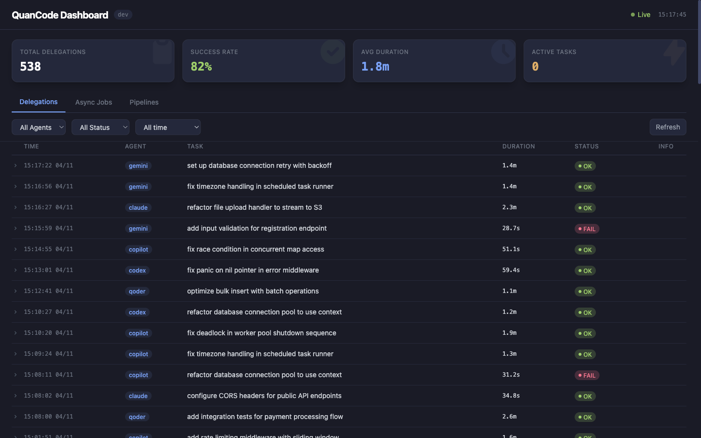

# QuanCode

**Orchestrate your terminal coding agents.**

<p align="center">
  
</p>
<p align="center"><em>538 delegations, five agents, one local dashboard — all running under your shell.</em></p>

[中文](README_zh.md)

QuanCode starts one AI coding agent as your primary and lets it delegate bounded tasks to the others — Claude Code, Codex, Gemini, Copilot, Qoder. Routing, git worktree isolation, verification, and fallback all handled locally. A single Go binary. No daemon, no hosted service, no vendor lock-in.

It is an orchestration layer, not an agent itself.

- **Lightweight** — a single Go binary with zero runtime dependencies. No daemon, no server, no framework.
- **Universal** — works with any coding CLI that accepts a prompt and returns text. Adding a new agent is a YAML config change, not code.
- **Self-controlled** — everything runs locally under your shell. You own the config, the logs, the prompts, and the process lifecycle. No hosted service, no vendor lock-in.

> **Status: beta**
> Core delegation, isolation, fallback, and verification flows are stable. Agent adapter coverage varies by CLI.

## Install

Prerequisites: at least one supported coding CLI installed and authenticated.

```bash
brew tap qq418716640/tap
brew install quancode
```

For Linux users without Homebrew, download the binary from [GitHub Releases](https://github.com/qq418716640/quancode/releases).

Check the installed version:

```bash
quancode version
```

## How It Works

```
You (natural language)
    |
Primary Agent (AI)
    |
quancode delegate/route/pipeline/...
    |
Sub-Agents (other CLIs)
```

You describe what you want in natural language. The primary AI agent autonomously decides when and how to delegate tasks to other agents — routing, isolation, verification, fallback — all handled transparently.

## Quick Start — Two Commands

### 1. Initialize (one-time)

```bash
quancode init
```

Scans your PATH for known coding CLIs, lets you pick a default primary, and writes `~/.config/quancode/quancode.yaml`.

### 2. Start a session (every day)

```bash
quancode start
```

Launches your primary AI agent with multi-agent delegation capabilities injected. From here, just talk to the AI in natural language. The AI knows how to delegate.

Override the primary for a single session:

```bash
quancode start --primary codex
```

**That's it.** These two commands cover 95% of daily usage.

## What the AI Does Autonomously

Once you start a session, you never need to call `quancode delegate` yourself. The AI knows how to:

- **Route tasks** to the best sub-agent based on keywords and priority
- **Inject context** — automatically attaches project files like `CLAUDE.md` and `AGENTS.md`
- **Isolate safely** — runs in git worktrees or patch-only mode when appropriate
- **Fallback automatically** — if an agent times out or hits rate limits, tries the next one
- **Verify results** — runs test commands after delegation to validate
- **Run pipelines** — chains multi-phase tasks with per-stage verification and fallback
- **Run async** — executes long-running tasks in the background with full lifecycle management

See the [User Guide](docs/user-guide.md) for detailed walkthroughs of each capability.

## Configuration

Config search order:

1. `--config <path>`
2. `./quancode.yaml`
3. `~/.config/quancode/quancode.yaml`
4. built-in defaults

Minimal example:

```yaml
default_primary: claude

agents:
  claude:
    name: Claude Code
    command: claude
    enabled: true
    primary_args: ["--append-system-prompt"]

  codex:
    name: Codex CLI
    command: codex
    enabled: true
    prompt_mode: file
    prompt_file: AGENTS.md
    delegate_args: ["exec", "--full-auto", "--ephemeral"]
    output_flag: --output-last-message
```

For a fuller starter config, copy [`quancode.example.yaml`](quancode.example.yaml).

Field-by-field config documentation is available in [`docs/agent-config-schema.md`](docs/agent-config-schema.md).

## Supported Agents

Built-in defaults currently cover:

- Claude Code — architecture, complex reasoning, multi-file edits
- Codex CLI — quick edits, code generation, test writing
- GitHub Copilot CLI — multi-model support, deep repository context
- Gemini CLI — large context window, multi-modal
- Qoder CLI — code analysis, debugging, MCP integration

Support is adapter-based rather than hardcoded. Different CLIs may use different prompt injection modes (CLI args, env vars, or a managed file like `AGENTS.md`). Adding a new CLI requires only configuration, not Go code.

A `/quancode` skill is available for Claude Desktop, Cowork, and Dispatch, enabling multi-agent delegation from those environments.

For compatibility expectations, see [`docs/compatibility.md`](docs/compatibility.md).

## Optional Tools for Power Users

**Health check:**
```bash
quancode doctor       # verify config, agents, and PATH
```

**Observability:**
```bash
quancode agents       # list enabled agents and availability
quancode stats        # delegation statistics
quancode dashboard    # web UI for monitoring (preview)
```

**Manual delegation (rare — AI usually does this for you):**
```bash
quancode delegate "write unit tests for config loading"
quancode delegate --agent codex --isolation worktree "refactor the helper"
```

Full command reference: see [User Guide](docs/user-guide.md).

## Safety Notes

- Delegated agents run in your working directory unless you use an isolation mode.
- `--isolation worktree` and `--isolation patch` require a git repository.
- File-based prompt injection is managed by QuanCode and should restore original content after the primary exits.
- Review sub-agent changes before committing them.

## Development

Run the standard checks:

```bash
go test ./...
go vet ./...
```

Release builds can override the default version string with Go ldflags.

Project entry points:

- `cmd/start.go`: primary startup
- `cmd/delegate.go`: sub-agent execution
- `cmd/apply_patch.go`: patch application for parallel delegation
- `agent/agent.go`: generic agent adapter
- `prompt/injection.go`: primary prompt construction
- `router/router.go`: agent selection
- `runner/`: execution and isolation helpers
- `ledger/`: delegation logs and stats
- `cmd/job*.go`: async job management commands
- `job/`: persistent job state and lifecycle

## Documentation

- User guide: [`docs/user-guide.md`](docs/user-guide.md)
- Config reference: [`docs/agent-config-schema.md`](docs/agent-config-schema.md)
- Compatibility: [`docs/compatibility.md`](docs/compatibility.md)
- Privacy: [`docs/privacy.md`](docs/privacy.md)
- Contributing: [`CONTRIBUTING.md`](CONTRIBUTING.md)
- Changelog: [`CHANGELOG.md`](CHANGELOG.md)

## License

Apache-2.0. See [LICENSE](LICENSE).
